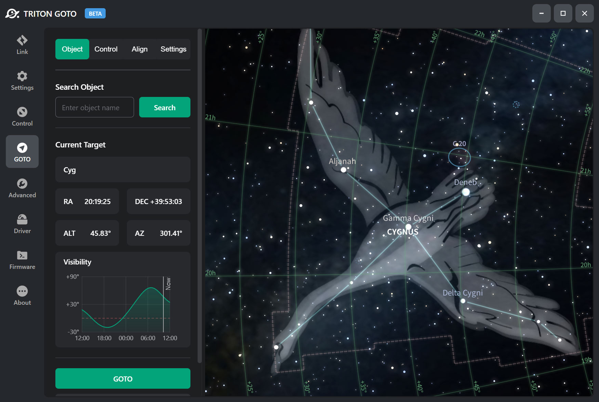
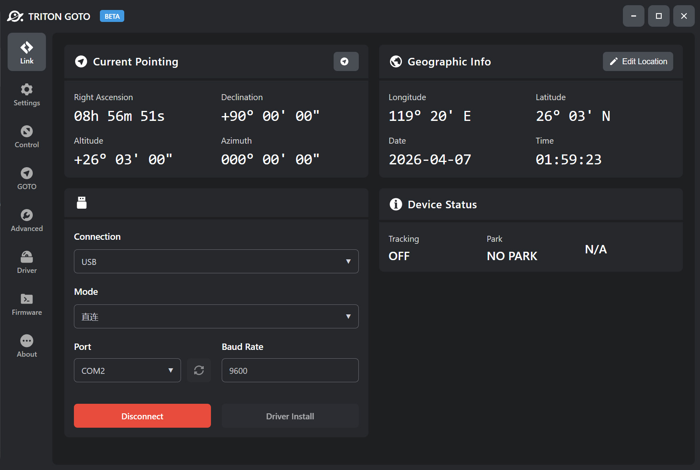
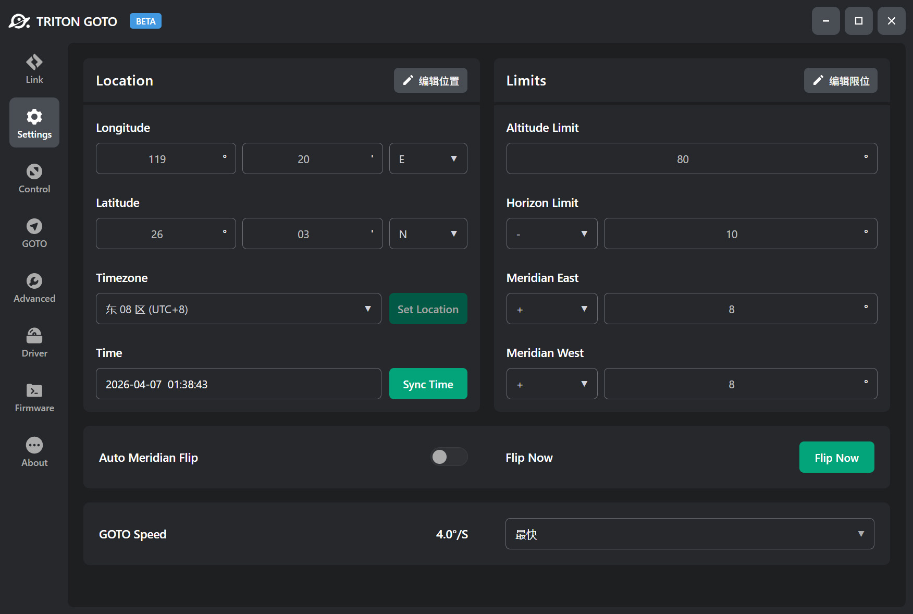
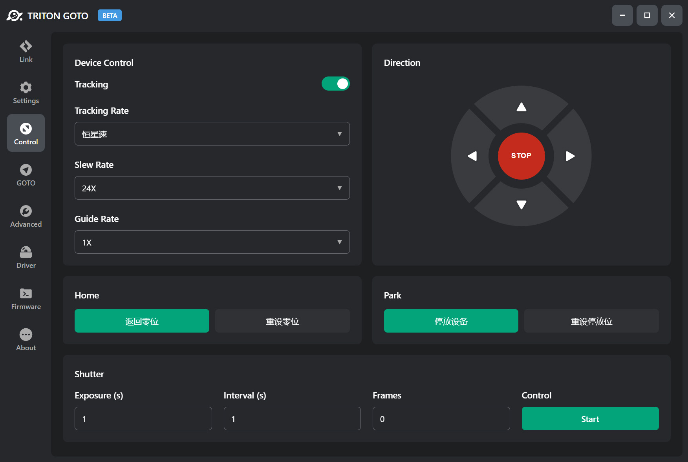
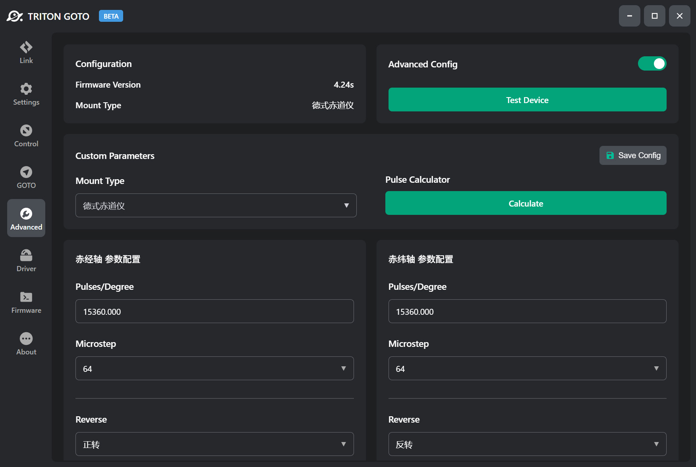

<h1 align="center">
  
   
  TRITON GOTO
   
</h1>

<h3 align="center">
新一代 ONSTEP 控制 APP
</h3>

新一代 ONSTEP 控制 APP，为基于 **ONSTEP** 构建天文设备的爱好者提供更好的使用体验。TRITON GOTO 有着更为现代的 UI/UX 设计，更稳定的连接体验，目前已适配移动端与 Windows 平台。

  语言:
  <a href="./README_zh.md">简体中文</a> ·
  <a href="./README.md">English</a>

  访问我们:
  <a href="https://tritongoto.cn/">网站</a> ·
  <a href="https://tritongoto.cn/download">下载</a>

---

# TRITON GOTO - ONSTEP PC 集成控制平台

**TRITON GOTO for Windows** 是一款适用于 ONSTEP 的全新控制应用，为基于 ONSTEP 构建天文设备的爱好者提供更好的使用体验。

**TRITON GOTO** 有着更为现代的 UI/UX 设计，更稳定的连接体验，以及更丰富的功能，完全兼容 **ONSTEP** 与 **ONSTEP X** 版本。

## 内置星图引擎

我们创新性地将星图引擎内置于应用中，解决以往需要跨越多个软件来回切换才能完成对望远镜进行控制的痛点。而现在，所有的基础控制流程都能直接在一款应用中完成。

## 全量控制支持

应用提供了 USB 串口 / WIFI / 蓝牙等多种连接方式，支持直连与 ASCOM 全局连接，可实现对 ONSTEP 的常规设置、自动寻星、三星校准、极轴校准、快门控制、高级配置等功能，页面简洁且操作简单，是目前功能集成度最高的 PC 端 ONSTEP 控制程序。

## 应用主页

显示望远镜常规信息，包括当前指向的赤道坐标与地平坐标，用户可快速查看设备当前状态。

## 设置页面

用于设置设备所在的地理位置相关信息，以及设备的限位、中天翻转、GOTO 速度等，支持通过网络获取地理位置。

## 控制页面

用于控制设备的状态，如启动/停止跟踪，设置跟踪速率，以及设备零位/停放位的相关控制与设置。

## 高级配置页面

用于 DIY 用户手动配置设备的传动参数，如修改设备对应轴的每度脉冲，电机驱动的细分，驱动电流以及电机的转向等参数。

